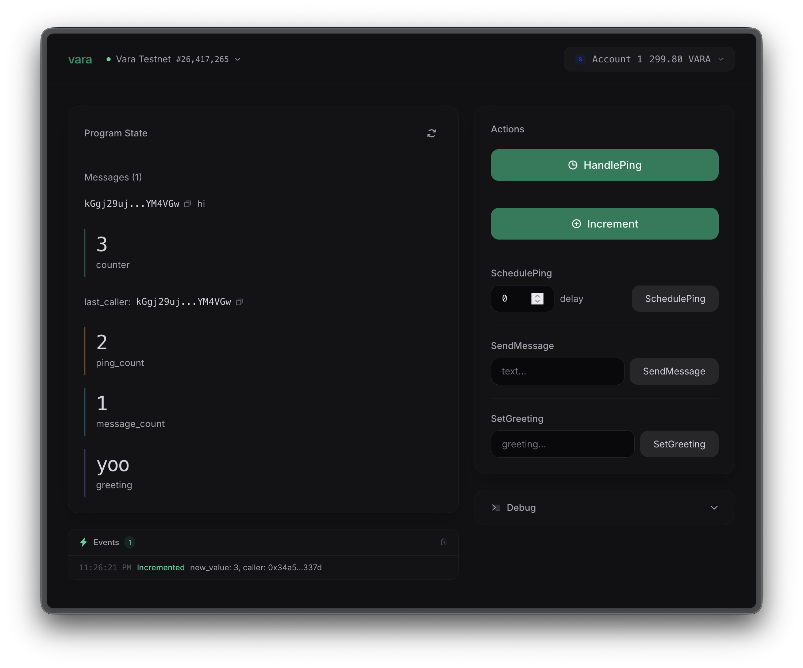

# create-vara-app

Scaffold a typed Vara dApp from any Sails IDL. React + TypeScript + wallet + events.



## Quick Start

```bash
npm exec --yes -- create-vara-app my-dapp
```

Or with your own contract IDL:

```bash
npm exec --yes -- create-vara-app my-dapp --idl path/to/service.idl
```

Then:

```bash
cd my-dapp/frontend
cp .env.example .env
# Set VITE_PROGRAM_ID to your deployed program address
npm run dev
```

## What You Get

- **Typed codegen** from Sails IDL: query/transaction wrappers, ActionsPanel, StatePanel
- **Wallet integration**: SubWallet, Polkadot.js, Talisman
- **Live event subscriptions** via sails-js
- **Client-side validation**: empty-string and min-value checks
- **Debug panel**: runtime IDL explorer with manual method calls
- **37 vitest tests** for the codegen pipeline

## Using the Demo Contract

This repo includes a reference Sails program at `programs/demo/` with:

- Counter, message board (ring buffer, 100 cap), delayed self-messaging, greeting
- 5 commands, 4 queries, 5 event types
- Input validation and error handling
- 10 gtest integration tests

### Build and test

```bash
cd programs/demo
cargo build --release
cargo test --release
```

### Full pipeline

```bash
./scripts/build.sh
```

Builds the program, syncs IDL to frontend, regenerates typed components, runs tests.

### Deploy

Deploy `programs/demo/target/wasm32-gear/release/demo.opt.wasm` to Vara testnet, copy the program ID to `frontend/.env` as `VITE_PROGRAM_ID`.

## Extending the Template

Add a method in Rust, rebuild, run the scaffold:

```bash
cd programs/demo && cargo build --release
cp demo.idl ../../frontend/src/assets/demo.idl
cd ../../frontend && npx tsx ../scripts/scaffold-client.ts
```

The scaffold regenerates `sails-client.ts`, `ActionsPanel.tsx`, and `StatePanel.tsx`. Custom code goes in separate files since generated files are overwritten on re-scaffold.

See `CLAUDE.md` for detailed patterns (state fields, events, type derives, delayed messages).

## Prerequisites

- Node.js 18+
- Rust stable with `wasm32-unknown-unknown` target (for building the contract)
- A Vara-compatible wallet extension

## Tech Stack

| Layer | Tech |
|-------|------|
| Contract | Rust, sails-rs 1.0.0-beta.2 |
| Frontend | React 18, TypeScript, Vite 6, Tailwind 3 |
| Chain | @gear-js/api 0.44.2, sails-js 0.5.1 |
| Codegen | sails-js-parser 0.5.1, tsx |
| Tests | gtest (Rust), vitest (TypeScript) |

## License

MIT
